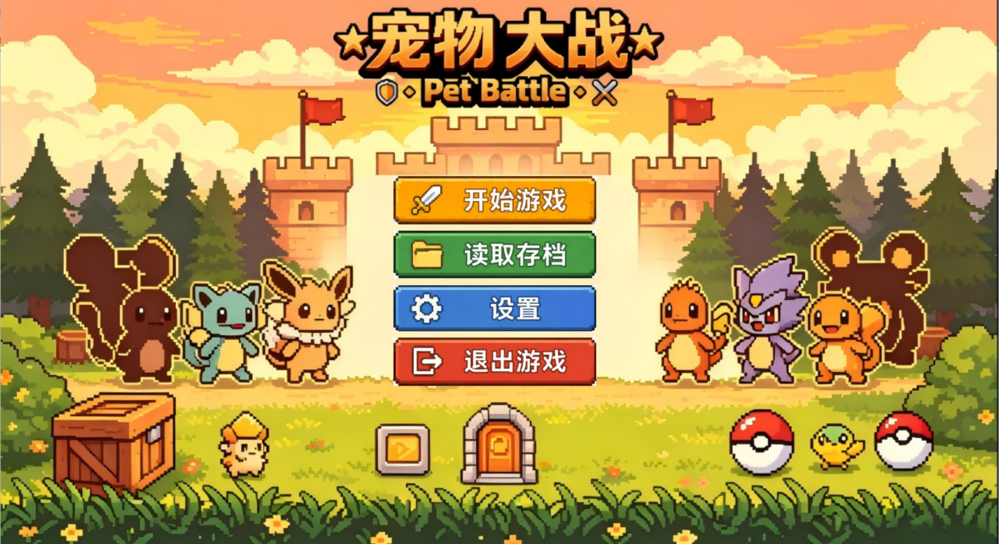

# 宠物大战（Pet Battle）

大一 C++ 课程设计项目：基于 EasyX 图形库开发的**回合制宠物对战小游戏**，使用 Visual Studio 2022 编译运行。项目采用面向对象设计，覆盖主菜单、宠物选择、回合制战斗、背包道具、三档存档、音量设置等完整游戏流程。



## 项目简介

宠物养成对战是经典的休闲游戏题材，成长、升级、怪物挑战、多存档等模块是大多数养成类游戏的通用基础架构。本项目以此为背景，用文字交互 + 图形界面的形式实现了一个完整的“选宠 → 战斗 → 背包 → 存档”游戏闭环：

- 全程鼠标点击操作，EasyX 绘制界面、血条与宠物形象；
- 菜单、战斗、背包、存档等模块拆分到独立文件，结构清晰；
- 以 `Attribute` 封装宠物属性、以 `PetBase` 作为宠物基类，通过继承实现三类各具特色的宠物。

## 功能特性

### 主菜单

- **开始游戏**：进入宠物选择界面
- **读取存档**：加载 3 个存档位，恢复宠物属性、背包道具与音量设置并直接进入战斗
- **系统设置**：分别调节菜单背景音乐、战斗音乐、点击音效（三档音量）
- **退出游戏**：关闭音频与图形窗口，安全结束程序

### 宠物选择

- 三类宠物可选：战士「小赤锋」、法师「星琉」、坦克「盾墩墩」
- 三类宠物在血量、攻击、防御、速度、魔力上各有侧重：

| 宠物 | 定位 | 特点 |
| ---- | ---- | ---- |
| 小赤锋（战士） | 均衡输出 | 攻防均衡，血量较高 |
| 星琉（法师） | 高伤耗魔 | 速度快、魔力高，技能伤害高 |
| 盾墩墩（坦克） | 防御反伤 | 血量极高、防御极高，防御时可反弹伤害 |

- 点击宠物即创建对应宠物对象并进入战斗，也可返回主菜单

### 回合制战斗

- 界面渲染：战斗背景、我方宠物、敌方魔物、双方血条、功能按钮
- **六大战斗操作**：
  - **撞击**：基础物理攻击
  - **远程**：消耗魔力造成高额伤害
  - **防御**：本回合受到的伤害减半；坦克宠物额外开启 40% 伤害反弹
  - **自辅**：获得 3 回合的攻击力增益
  - **背包**：打开道具窗口使用道具（不消耗回合）
  - **逃跑**：终止战斗，返回主菜单
- 敌方魔物每回合自动攻击，伤害按我方防御计算减伤
- 胜负判定：魔物血量归零获胜、我方宠物血量归零失败，自动回到主菜单
- 战斗内设置弹窗：可随时调节战斗音乐与音效，或一键保存进度到 3 个存档位

### 背包道具

- 内置回血药、魔力药水两类道具
- 点击道具自动消耗并恢复宠物血量或魔力，道具数量实时减少
- 道具数据随存档同步保存

## 技术栈

- C++（面向对象：类、继承、多态、封装）
- EasyX 图形库：窗口渲染、按钮弹窗、鼠标交互、血条绘制、音频播放
- Visual Studio 2022（v143 工具集，Unicode 字符集，x64 平台）+ Windows 11

## 设计要点

- **分层封装**：`Attribute` 类统一封装生命、攻击、防御、速度、魔力等基础属性；`PetBase` 基类统一管理宠物行为，`WarriorPet` / `MagePet` / `TankPet` 通过公有继承派生，扩展方便
- **接口隔离**：属性通过成员函数读写，禁止外部直接访问，避免数值异常
- **模块化开发**：菜单、战斗、存档、音频等功能拆分为独立模块，头文件与源文件分离
- **双缓存绘制**：解决界面高频刷新时的画面闪烁问题
- **中文适配**：Unicode 宽字符渲染 + GBK 编码，保证中文正常显示

## 编译运行

1. 安装 Visual Studio 2022，勾选【使用 C++ 的桌面开发】工作负载
2. 到 EasyX 官网（https://easyx.cn ）下载 EasyX，按提示安装到 VS2022
3. 双击打开 `宠物大战/宠物大战666.sln`
4. 顶部配置选择 **Debug + x64**
5. 按 `F5`（或点“本地 Windows 调试器”）编译并运行

## 目录结构

```text
.
├── 宠物大战666.sln          # VS2022 解决方案
└── 宠物大战666/             # 项目源码
    ├── main.cpp             # 程序入口
    ├── Menu.cpp / Menu.h    # 主菜单、宠物选择、设置界面
    ├── Battle.cpp / Battle.h# 回合制战斗逻辑与界面（含宠物类体系）
    ├── SaveData.cpp / SaveData.h  # 存档 / 读档
    └── res/                 # 图片、背景音乐、音效素材
```

## 常见问题

- **中文乱码**：源码文件为中文（GBK 编码）保存，在中文版 Windows + VS2022 下可直接编译；若打开后中文显示乱码，可在 VS 中打开文件时选择“编码 936”。
- **资源加载失败**：运行时从 `res` 目录读取图片与音乐，请保持 `res` 与可执行文件在同一目录。

## 后续可扩展方向

- 敌人类型与等级区间：目前敌方魔物固定，可增加敌人生成池，按玩家等级刷新对应强度
- 战斗机制：可增加暴击、闪避、护盾、持续伤害等状态，并补充回合日志
- 内容系统：宠物图鉴、成就系统，记录击败过的宠物并解锁成就
- 存档体验：增加自动存档，战斗结束或升级后自动保存，避免丢失进度
