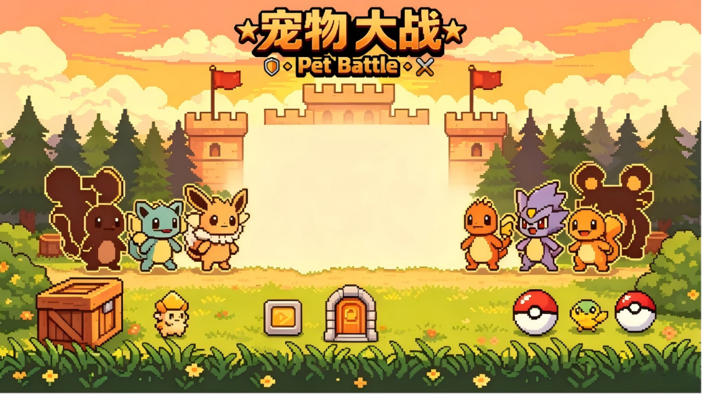

# 宠物大战（Pet Battle）

大一 C++ 课程设计项目：基于 EasyX 图形库制作的**回合制宠物对战小游戏**，使用 Visual Studio 2022 编译运行。



## 功能特性

- 主菜单界面：开始游戏、读档、设置、退出
- 三只宠物可选：战士型、法师型、坦克型，各有不同的属性与定位
- 回合制战斗：普通攻击 + 技能（撞击、远程、防御、自愈等）
- 背包道具：小型回血药、中型回血药、魔法药水
- 三档存档 / 读档，自动记录宠物属性、背包与音量设置
- 音量设置：背景音乐、战斗音乐、音效分别调节
- 胜利 / 失败结算界面，全程配背景音乐与音效

## 技术栈

- C++（面向对象：类、继承、多态）
- EasyX 图形库（界面绘制、鼠标键盘交互、音频播放）
- Visual Studio 2022（v143 工具集，Unicode，x64）

## 编译运行

1. 安装 Visual Studio 2022，勾选【使用 C++ 的桌面开发】工作负载
2. 到 EasyX 官网（https://easyx.cn）下载 EasyX，按提示安装到 VS2022
3. 双击打开 `宠物大战/宠物大战666.sln`
4. 顶部配置选择 **Debug + x64**
5. 按 `F5`（或点“本地 Windows 调试器”）编译并运行

## 目录结构

```text
.
├── 宠物大战666.sln          # VS2022 解决方案
└── 宠物大战666/             # 项目源码
    ├── main.cpp             # 程序入口
    ├── Menu.cpp / Menu.h    # 主菜单、选宠、设置界面
    ├── Battle.cpp / Battle.h# 回合制战斗逻辑与界面
    ├── SaveData.cpp / SaveData.h  # 存档 / 读档
    ├── save1.txt ~ save3.txt      # 存档数据
    └── res/                 # 图片、背景音乐、音效素材
```

## 常见问题

- 源码文件为中文（GBK 编码）保存，在中文版 Windows + VS2022 下可直接编译；若打开后中文显示乱码，可在 VS 中打开文件时选择“编码 936”。
- 运行时会读取 `res` 目录下的素材，请保持 `res` 与可执行文件在同一目录。
